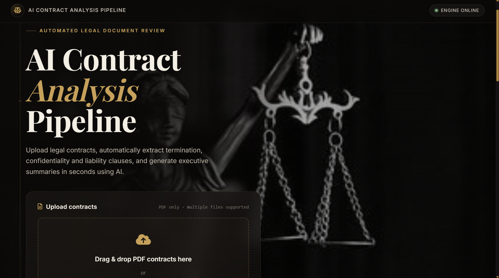

<div align="center">

# 📑 AI Contract Analysis Pipeline

**Automated legal contract analysis powered by LLMs — extract clauses, generate summaries, and produce structured reports in seconds instead of hours.**

[](https://www.python.org/)
[](https://fastapi.tiangolo.com/)
[](https://docs.pydantic.dev/)
[](https://groq.com/)
[](#license)
[]()

</div>

<div align="center">



</div>

---

## 📌 Short Description

**AI Contract Analysis Pipeline** is a backend + web application that reads legal contract PDFs, intelligently locates the clauses that matter most (Termination, Confidentiality, Liability), and uses a large language model (Llama 3.3 70B via Groq) to extract structured data and generate a plain-English executive summary — output as both **JSON** (for developers) and **CSV** (for spreadsheets and non-technical reviewers).

---

## 🤔 Why This Project?

Reading legal contracts is one of the most tedious and error-prone tasks in business, law, and procurement.

| Problem with Manual Review | Real-World Impact |
|---|---|
| ⏳ **Time-consuming** | A single 40-page contract can take 30–60 minutes to read carefully |
| 😴 **Human fatigue** | Reviewers skim after page 20, increasing the chance of missing something |
| ❌ **Missed clauses** | A single overlooked termination or liability clause can cause serious financial or legal damage |
| 📚 **Volume** | Companies dealing with dozens of vendor/partner contracts cannot manually review all of them at scale |
| 🧠 **Inconsistent judgment** | Different reviewers may summarize the same contract differently |

> **Why AI helps:** A large language model doesn't get tired, doesn't skip pages, and can be instructed to consistently look for the same categories of risk every single time. It won't replace a lawyer's judgment — but it can massively cut down the *time to first understanding* of a contract, flag what to look at closely, and produce a consistent, structured starting point for human review.

This project was built to demonstrate — and actually use — that idea in a working, end-to-end pipeline.

---

## 🧭 What This Project Does

In plain English, here's what happens when you use this application:

1. You open the web page and **upload one or more PDF contracts**.
2. The backend **reads the text** out of each PDF.
3. It **cleans up** that text (removing noise like page numbers, broken line breaks, etc.).
4. It **searches within the contract** for the parts that talk about Termination, Confidentiality, and Liability — instead of using the entire document.
5. Only those relevant sections are sent to the **LLM (Llama 3.3 70B via Groq)**, which extracts the clauses into structured data and writes an easy-to-read summary.
6. The results are returned to you as **downloadable JSON and CSV files**, plus shown in a simple dashboard in the browser.

No legal knowledge is required to use it — the whole point is that the tool absorbs the complexity so you don't have to.

---

## ✨ Features

- 📤 **Multi-PDF upload** through a simple web interface
- 🔍 **Targeted clause retrieval** for Termination, Confidentiality, and Liability sections
- 🤖 **LLM-powered extraction** using Llama 3.3 70B Versatile (via Groq's API)
- 📝 **Automatic executive summaries** in plain English
- 📦 **Structured JSON output** for developers and downstream systems
- 📊 **CSV export** for spreadsheet-based review
- 🔁 **Automatic retries** on transient API failures (via Tenacity)
- 🛡️ **Input validation** using Pydantic v2 schemas
- 🧾 **Logging** throughout the pipeline for observability and debugging
- 🌐 **REST API** built with FastAPI, fully documented and inspectable

---

## 🏗️ Complete Architecture

```
                         ┌───────────────┐
                         │      User     │
                         └───────┬───────┘
                                 │  uploads PDF(s)
                                 ▼
                         ┌───────────────┐
                         │   Frontend    │  (HTML / CSS / JS)
                         └───────┬───────┘
                                 │  HTTP request
                                 ▼
                         ┌───────────────┐
                         │    FastAPI    │  (routing, validation)
                         └───────┬───────┘
                                 ▼
                         ┌───────────────┐
                         │  PDF Loader   │  (PyMuPDF text extraction)
                         └───────┬───────┘
                                 ▼
                         ┌───────────────┐
                         │ Preprocessor  │  (text cleaning & normalization)
                         └───────┬───────┘
                                 ▼
                         ┌───────────────┐
                         │   Retriever   │  (finds only relevant clauses)
                         └───────┬───────┘
                                 ▼
                         ┌───────────────┐
                         │      LLM      │  (Llama 3.3 70B via Groq)
                         └───────┬───────┘
                                 ▼
                         ┌───────────────┐
                         │Clause Extract.│  (structured clause data)
                         └───────┬───────┘
                                 ▼
                         ┌───────────────┐
                         │    Summary    │  (executive summary text)
                         └───────┬───────┘
                                 ▼
                    ┌────────────┴────────────┐
                    ▼                         ▼
             ┌─────────────┐           ┌─────────────┐
             │    JSON     │           │     CSV     │
             └─────────────┘           └─────────────┘
```

### 🔎 What Each Block Does

| Block | Responsibility |
|---|---|
| **Frontend** | Collects PDF uploads, shows progress, displays and lets you download results |
| **FastAPI** | Receives HTTP requests, validates input, orchestrates the pipeline, returns responses |
| **PDF Loader** | Converts raw PDF bytes into plain text using PyMuPDF |
| **Preprocessor** | Cleans extracted text (removes noise, fixes spacing/line breaks) so the LLM sees clean input |
| **Retriever** | Searches the cleaned text for sections relevant to Termination, Confidentiality, and Liability — **this is the key cost/performance optimization of the whole project** |
| **LLM** | Receives only the retrieved context and performs clause extraction + summarization |
| **Clause Extraction** | Structures the LLM's output into a defined schema (Pydantic models) |
| **Summary** | A short, plain-English overview of what the contract means in practice |
| **JSON** | Machine-readable structured output |
| **CSV** | Human-readable, spreadsheet-friendly output |

---

## 📂 Folder Structure

```
ai-contract-analysis-pipeline/
│
├── app/
│   ├── config.py            # Centralized configuration & environment variable loading
│   ├── models.py             # Pydantic v2 schemas for requests, responses, and clause data
│   ├── pdf_loader.py          # Extracts raw text from uploaded PDF files (PyMuPDF)
│   ├── preprocessor.py        # Cleans and normalizes extracted text
│   ├── retriever.py           # Locates relevant contract sections (Termination/Confidentiality/Liability)
│   ├── extractor.py           # Sends retrieved context to the LLM and parses clause data
│   ├── summarizer.py          # Generates the plain-English executive summary
│   ├── pipeline.py            # Orchestrates the full flow: load → clean → retrieve → extract → summarize
│   └── utils.py               # Shared helper functions (logging setup, retries, file handling)
│
├── static/                   # Frontend assets (HTML, CSS, JavaScript)
│   ├── index.html
│   ├── style.css
│   └── script.js
│
├── outputs/                  # Generated JSON/CSV reports (created at runtime)
│
├── requirements.txt           # Python dependencies
├── .env.example                # Template for required environment variables
└── README.md
```

### Why Each File Exists

| File | Why It Exists |
|---|---|
| `config.py` | Keeps all settings (API keys, model name, limits) in one place instead of scattered across the codebase — makes the project easier to configure and maintain |
| `models.py` | Defines exactly what valid input/output looks like using Pydantic v2, so bad data is caught early instead of causing silent bugs |
| `pdf_loader.py` | Isolates PDF-reading logic — if the PDF library ever needs to change, only this file is touched |
| `preprocessor.py` | Text cleaning is a distinct concern from extraction; keeping it separate makes both easier to test and reason about |
| `retriever.py` | Contains the most important optimization in the project (see [How the Pipeline Works](#-how-the-pipeline-works)) — isolated so the retrieval strategy can be upgraded later (e.g., to a vector database) without touching the rest of the pipeline |
| `extractor.py` | Owns all communication with the LLM for clause extraction — keeping the LLM client isolated means switching providers later requires minimal changes |
| `summarizer.py` | Summarization is a distinct LLM task from clause extraction, so it's kept in its own module for clarity and independent iteration |
| `pipeline.py` | Acts as the "conductor" — calls each stage in order so `main.py`/API routes stay thin and readable |
| `utils.py` | Avoids duplicating logging, retry, and file-handling code across modules |

---

## ⚙️ How the Pipeline Works

### 1. User Uploads PDFs
The user selects one or more PDF files in the browser. The frontend sends them to the FastAPI backend as a `multipart/form-data` request. FastAPI validates the file type and size before anything else happens.

### 2. PDF Loader
`pdf_loader.py` uses **PyMuPDF (fitz)** to open each PDF and extract its raw text, page by page. PyMuPDF was chosen because it is fast and reliable at extracting text while preserving reasonable structure (paragraphs, line breaks) compared to simpler text-scraping approaches.

### 3. Preprocessor
Raw text extracted from PDFs is messy: broken line breaks, repeated headers/footers, inconsistent spacing, and stray page numbers. The **Preprocessor** cleans this up before anything is sent to an LLM. Clean input matters because:
- It reduces token count (cleaner text = fewer wasted tokens on noise)
- It improves the retriever's ability to find real clause boundaries
- It reduces the chance of the LLM getting confused by broken formatting

### 4. Retriever — The Most Important Design Decision in This Project 🎯

> ⚠️ **This is the core optimization that makes the entire project practical to run on a free API tier.**

**The problem:** Early in development, the entire contract text was sent directly to the LLM for every request. This works for small contracts, but it creates three serious problems:

| Problem | Why It Matters |
|---|---|
| 💸 **High token usage** | Every page of the contract counts as tokens, even boilerplate that has nothing to do with Termination, Confidentiality, or Liability |
| 🐢 **Slower responses** | Larger inputs take longer for the LLM to process |
| 🚫 **API limit failures** | Large contracts can exceed the model's context window or the API provider's per-request/per-day token quota |

**The solution:** Instead of sending the whole contract, the `retriever.py` module **searches the cleaned contract text for the specific sections that are actually relevant** — the parts that discuss:

- 🛑 **Termination**
- 🔒 **Confidentiality**
- ⚖️ **Liability**

Only this **retrieved context** — a small, focused subset of the document — is passed to the LLM. The rest of the contract (introductions, definitions, boilerplate, signatures, etc.) is never sent at all.

**Why this matters, explained simply:**

- 📉 **Fewer tokens sent = lower cost.** LLM APIs charge (or rate-limit) based on token count. Sending 2 relevant paragraphs instead of 40 pages can reduce tokens sent by an order of magnitude.
- ⚡ **Fewer tokens = faster responses.** Smaller inputs are processed more quickly by the model, so users get results sooner.
- 🆓 **This makes free-tier usage realistic.** Free API tiers (like Groq's) come with daily token limits. By being selective about what gets sent, the same daily quota can process **many more contracts** than a naive "send everything" approach.
- 🎯 **It also improves output quality.** LLMs perform better when given focused, relevant context rather than being asked to find a needle in a haystack across a huge document.

In short: the Retriever is what turns this from "a project that only works on tiny contracts with a paid API plan" into "a project that works on real contracts, on a free tier, at reasonable speed."

### 5. LLM — Clause Extraction & Summarization
The retrieved context is sent to **Llama 3.3 70B Versatile** via the **Groq API**. Groq was chosen for its very fast inference speed, and Llama 3.3 70B for its strong general reasoning ability at extracting structured information from legal-style text.

### 6. Clause Extraction
The LLM's response is parsed into a strict **Pydantic v2 schema** — not free-form text. This means every response is guaranteed to have predictable fields (e.g., `termination_clause`, `confidentiality_clause`, `liability_clause`) rather than a paragraph the calling code has to guess how to parse. Structured output is critical because:
- It allows the JSON/CSV outputs to be generated reliably every time
- It allows the frontend to render results consistently
- It catches malformed LLM responses early, before they reach the user

### 7. Executive Summary
Alongside clause extraction, the LLM also produces a short **plain-English summary** of the contract. This exists specifically for **non-technical stakeholders** — a manager or business owner who doesn't want to read raw clause text but wants to understand, in a sentence or two, what the contract actually commits them to.

### 8. Output Formats
Both **JSON** and **CSV** are generated from the same underlying data:

| Format | Best For | Why It's Provided |
|---|---|---|
| **JSON** | Developers, downstream systems, APIs | Structured, nested, easy to integrate programmatically |
| **CSV** | Business users, spreadsheet review, Excel/Sheets | Easy to open, sort, and filter without any technical tools |

Providing both means the same analysis serves both a developer integrating this into another system and a business user who just wants to open a spreadsheet.

---

## 🖥️ Frontend

The frontend is a lightweight **HTML / CSS / JavaScript** interface (no framework) that provides:

- 📤 A file **upload** control for one or more PDFs
- ⏳ A **progress indicator** while the pipeline processes the contract(s)
- 📋 A **results dashboard** showing extracted clauses and the executive summary per contract
- ⬇️ **Download buttons** for both JSON and CSV reports

It was intentionally kept simple and dependency-free so the project remains easy to run and inspect without a frontend build step.

---

## 🔌 API Endpoints

| Method | Endpoint | Description |
|---|---|---|
| `POST` | `/upload` | Accepts one or more PDF files and stores them for processing |
| `POST` | `/analyze` | Runs the full pipeline (load → preprocess → retrieve → extract → summarize) on uploaded contract(s) |
| `GET` | `/download/json` | Returns the analysis results as a downloadable JSON file |
| `GET` | `/download/csv` | Returns the analysis results as a downloadable CSV file |
| `GET` | `/health` | Simple health-check endpoint to confirm the API is running |

---

## 🛠️ Installation

```bash
# 1. Clone the repository
git clone https://github.com/<your-username>/ai-contract-analysis-pipeline.git
cd ai-contract-analysis-pipeline

# 2. Create and activate a virtual environment
python -m venv venv
source venv/bin/activate       # On Windows: venv\Scripts\activate

# 3. Install dependencies
pip install -r requirements.txt

# 4. Set up environment variables
cp .env.example .env
# then edit .env and add your GROQ_API_KEY

# 5. Run the FastAPI server
uvicorn app.main:app --reload
```

Once running, open your browser to `http://localhost:8000` to use the web interface, or `http://localhost:8000/docs` for the interactive API documentation.

---

## 🔐 Environment Variables

| Variable | Description |
|---|---|
| `GROQ_API_KEY` | Your API key for authenticating with the Groq API |
| `LLM_MODEL` | The model identifier used for extraction/summarization (e.g., `llama-3.3-70b-versatile`) |
| `MAX_UPLOAD_SIZE_MB` | Maximum allowed size per uploaded PDF |
| `LOG_LEVEL` | Logging verbosity (e.g., `INFO`, `DEBUG`) |

> 💡 Exact variable names may vary slightly depending on your `.env.example` — check that file for the authoritative list.

---

## 📄 Example Outputs

**JSON Output**

```json
{
  "contract_name": "vendor_agreement.pdf",
  "clauses": {
    "termination": "Either party may terminate this agreement with 30 days written notice.",
    "confidentiality": "Both parties agree to keep all shared information confidential for 5 years.",
    "liability": "Liability is limited to the total fees paid under this agreement."
  },
  "executive_summary": "This is a standard vendor agreement that either party can exit with 30 days notice, requires confidentiality for 5 years, and caps liability at the total fees paid.",
  "generated_at": "2026-07-14T10:32:00Z"
}
```

**CSV Output**

```csv
contract_name,termination,confidentiality,liability,executive_summary
vendor_agreement.pdf,"Either party may terminate with 30 days notice.","Confidential for 5 years.","Limited to total fees paid.","Standard vendor agreement, exitable with 30 days notice."
```

---

## 🧯 Error Handling

| Mechanism | Purpose |
|---|---|
| **Logging** | Every stage of the pipeline logs key events and failures for debugging and traceability |
| **Retry Mechanism (Tenacity)** | Automatically retries transient failures (e.g., temporary API timeouts) with backoff, instead of failing the whole request on a single hiccup |
| **Validation (Pydantic v2)** | Input and output are validated against strict schemas, catching malformed data before it propagates |
| **API Failure Handling** | Errors from the Groq API (rate limits, timeouts) are caught and returned as clear error responses instead of crashing the server |

---

## ⚡ Performance Optimization

The single biggest performance lever in this project is the **Retriever stage**, described in detail above. To summarize its impact honestly, without exaggeration:

- ✅ Sending only relevant contract sections (Termination/Confidentiality/Liability) instead of the full document **reduces the number of tokens sent per request**, compared to a naive "send the whole PDF" implementation.
- ✅ This reduction has **already been implemented** in the current codebase — it is not a future improvement, it is how the retriever currently works.
- ✅ Fewer tokens per request means **more requests can fit within a fixed daily token quota** (such as Groq's free tier), allowing more contracts to be processed per day than the naive approach would allow.
- ✅ Smaller inputs also mean **each individual response is returned faster**, since the model has less text to process.

No specific benchmark numbers (e.g., "50% faster") are claimed here, since actual savings depend heavily on contract length and structure — the point is architectural: relevant-only retrieval is strictly more efficient than sending entire documents.

---

## ⚠️ Known Limitation

> This project currently uses **Groq's free API tier**, which comes with **daily token limits**.

As a result, the number of contracts that can be processed in a single day depends on:

- 📏 The size of each contract
- 🔍 The size of the context retrieved from that contract
- 🎚️ The token limits imposed by the model/provider

**This is important to understand correctly: this is not a limitation of the software itself — it is a limitation of the API quota currently being used.**

If a **Groq Paid Tier** — or another LLM provider with a higher token quota — is used instead, the application would be able to process significantly more contracts per day **without any change to the pipeline architecture**.

This is possible because the LLM client (`extractor.py` / `summarizer.py`) was **intentionally isolated** from the rest of the pipeline. Switching providers or upgrading tiers requires changing configuration and, at most, a small amount of client code — not a redesign of the system.

---

## 🚀 Future Improvements

- 🗄️ **Vector database** integration for smarter, embedding-based retrieval
- 🧠 **Semantic retrieval** instead of keyword/section-based retrieval
- 🐳 **Docker** support for consistent, portable deployment
- ☁️ **Cloud deployment** (e.g., AWS/GCP/Azure)
- 🔑 **Authentication** for multi-user access control
- 🔡 **OCR support** for scanned (image-based) PDFs
- 📬 **Queue system** for handling large batches of contracts asynchronously
- 🗃️ **Database** integration for persisting historical analysis results

---

## 🖼️ Screenshots

*[Upload Screen Placeholder]*

*[Progress/Processing Screen Placeholder]*

*[Results Dashboard Placeholder]*

*[JSON/CSV Download Screen Placeholder]*

---

## 📜 License

This project is licensed under the **MIT License** — see the `LICENSE` file for details.

---

## 👤 Author

**Ayush Pandey**

---

<div align="center">

*Built to make legal contract review faster, more consistent, and accessible to non-lawyers — without pretending to replace one.*

</div>